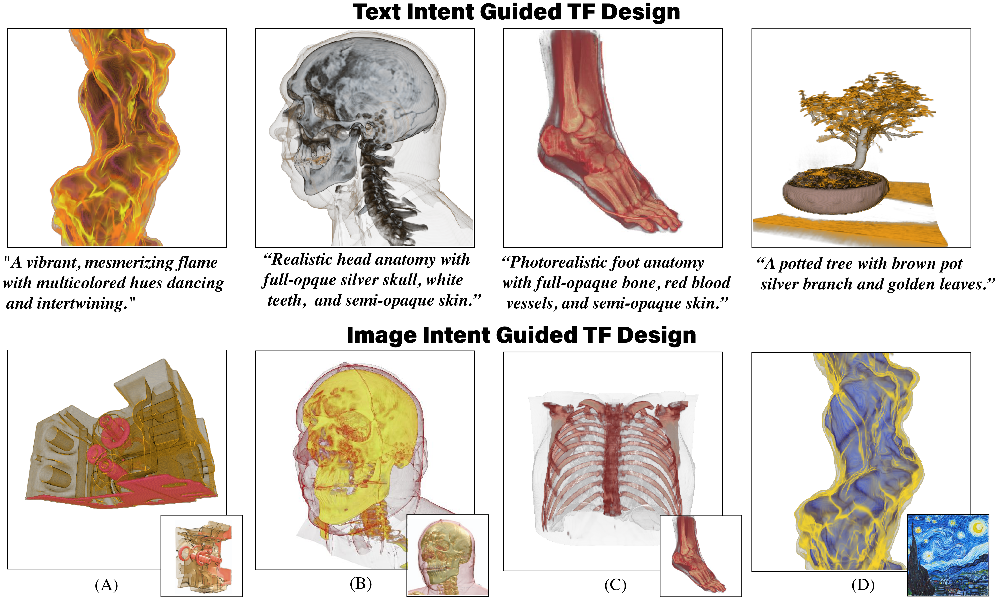

<!-- Improved compatibility of back to top link: See: https://github.com/othneildrew/Best-README-Template/pull/73 -->
<a id="readme-top"></a>
<!--
*** Thanks for checking out the Best-README-Template. If you have a suggestion
*** that would make this better, please fork the repo and create a pull request
*** or simply open an issue with the tag "enhancement".
*** Don't forget to give the project a star!
*** Thanks again! Now go create something AMAZING! :D
-->


<!-- PROJECT SHIELDS -->
<!--
*** I'm using markdown "reference style" links for readability.
*** Reference links are enclosed in brackets [ ] instead of parentheses ( ).
*** See the bottom of this document for the declaration of the reference variables
*** for contributors-url, forks-url, etc. This is an optional, concise syntax you may use.
*** https://www.markdownguide.org/basic-syntax/#reference-style-links
-->

  <h1 align="center">IntuiTF: MLLM-Guided Transfer Function Optimization for Direct Volume Rendering</h3>

  <p align="center">
  📄 <a href="https://arxiv.org/abs/2506.18407">arXiv</a> • 🌐 <a href="https://zjuvai.cn/TFEvolve/">Project Page</a>
</p>
  
<!-- PROJECT LOGO -->
<br />
<div align="center">
  <a href="https://github.com/wyysteelhead/TFEvolve">
    
  </a>


<!-- TABLE OF CONTENTS -->
<details>
  <summary>Table of Contents</summary>
  <ol>
    <li>
      <a href="#about-the-project">About The Project</a>
    </li>
    <li>
      <a href="#getting-started">Getting Started</a>
      <ul>
        <li><a href="#prerequisites">Prerequisites</a></li>
        <li><a href="#Installation">Installation</a></li>
      </ul>
    </li>
    <li><a href="#usage">Usage</a></li>
    <li><a href="#Evaluation">Evaluation</a></li>
    <li><a href="#BibTeX">BibTeX</a></li>
  </ol>
</details>


  <p align="center">
  We present IntuiTF, a novel framework that bridges the semantic gap between user intent and transfer function design in Direct Volume Rendering. Our system allows users to intuitively specify visualization goals through multimodal interactions through two core innovations: (1) an evolution-based TF space explorer that effectively navigates the vast parameter space, and (2) a generalized quality evaluator powered by Multi-modal Large Language Models (MLLMs) that provides intelligent visual guidance. Through these components, users can intuitively express their visualization goals while the system automatically optimizes TFs to match their intent. Our framework demonstrates superior generalizability across various volumetric datasets and significantly improves the efficiency of TF design compared to traditional approaches.
  </p>
</div>

<!-- ABOUT THE PROJECT -->

## About The Project

IntuiTF is an intelligent transfer function (TF) design framework that bridges the semantic gap between user visual intent and transfer function design in Direct Volume Rendering. By leveraging Multi-modal Large Language Models (MLLMs), our system makes volumetric data visualization more intuitive and efficient.

Here's what makes IntuiTF special:
* 🎯 **Intent-Driven Design:** Bridges the semantic gap between user visual intent and transfer function parameters through intelligent automation.
* 🧬 **Evolution-Based Explorer:** Employs genetic algorithms with efficient TF encoding for effective exploration of the vast parameter space.
* 🤖 **MLLM-Powered Evaluator:** Uses Multi-modal Large Language Models to provide human-aligned visual quality assessment and intent matching.
* 🔄 **Three-Stage Optimization:** Formalizes expert TF design process into Trial, Insight, and Replanning stages for systematic optimization.
* 🌐 **Superior Generalizability:** Demonstrates effectiveness across various volumetric datasets and visualization scenarios.

Compared to existing approaches, IntuiTF offers:
- Reduced semantic gap between user intent and TF design
- Automated optimization guided by human-aligned evaluation
- Enhanced generalizability across diverse datasets
- Improved efficiency in achieving desired visualization results

We welcome suggestions and contributions! Feel free to fork the repo, create a pull request, or open an issue.

<p align="right">(<a href="#readme-top">back to top</a>)</p>


<!-- 🚀 Getting Started -->
## 🚀 Getting Started

Follow these steps to set up TFEvolve locally.

### 🛠️ Prerequisites

Make sure you have the following installed:
* Python 3.8.8
* CUDA (for GPU acceleration)
* Conda
* DiffDVR (https://github.com/shamanDevel/DiffDVR)

### 📦 Installation

1. Clone the repository:
```bash
git clone https://github.com/wyysteelhead/TFevolve.git
cd TFevolve
```

2. Create and activate the conda environment:
```bash
conda create -n tfevolve python=3.8.8
conda activate tfevolve
```

3. Install DiffDVR first:
```bash
git clone https://github.com/shamanDevel/DiffDVR.git
cd DiffDVR
# Follow DiffDVR installation instructions
cd ..
```

4. Install dependencies:
```bash
pip install -r requirements.txt
```

<p align="right">(<a href="#readme-top">back to top</a>)</p>


<!-- 🧑‍💻 Usage -->
## 🧑‍💻 Usage

You can run the genetic optimization directly using the `genetic.py` script. Here's the complete command structure:

```bash
python genetic_optimize/genetic.py \
    --base_url [YOUR_API_URL] \
    --api_key [YOUR_API_KEY] \
    --config_file "[/path/to/config.json]" \
    --prompt_folder ./prompt \
    --population_size 50 \
    --generations 30 \
    --save_interval 1 \
    --instruct_number "[task_name]" \
    --save_path "[/path/to/save/results]" \
    --quality_metrics "16,11,14" \
    --text_metrics "5" \
    --intent_interval "16" \
    --bg_color "(255,255,255)" \
    --style_image "[/path/to/style/image.png]" \
    --model_name [MODEL_NAME]
```

#### Command Parameters

- `--base_url`: API endpoint URL
- `--api_key`: Your API key
- `--config_file`: Path to the dataset configuration file, our example config file locates in ./diffdvr/config-files
- `--prompt_folder`: Directory containing prompt templates and instructions (our settings locates in ./prompt)
- `--population_size`: Size of the genetic algorithm population
- `--generations`: Number of generations to run
- `--save_interval`: How often to save results (default: 1)
- `--instruct_number`: The text instruction to use. Our instructions are kept in ./prompt/instructions.json. To customize your own instructon, add a new record in instructions.json, and call the unique id of the record
- `--save_path`: Where to save the results
- `--quality_metrics`: Quality assessment metrics defined in TFEvolve/prompt/aspects.json (comma-separated, default: "16,11,14")
- `--text_metrics`: Text-based metrics (default: "5")
- `--intent_interval`: Start round of intent alignment (default: "16")
- `--bg_color`: Background color in RGB format (default: "(255,255,255)")
- `--style_image`: Path to style reference image
- `--model_name`: Name of the model to use (default: "gemini-2.0-flash-001")

#### Example Configurations

1. Image-based transfer function design:
```bash
python genetic_optimize/genetic.py \
    --config_file "./diffdvr/config-files/head.json" \
    --population_size 50 \
    --generations 30 \
    --save_interval 5 \
    --save_path "./results/head_image" \
    --style_image "./prompt/head.png"
    --quality_metrics "16,11,14" \
    --intent_interval "16"
```

2. Text-based transfer function design:
```bash
python genetic_optimize/genetic.py \
    --config_file "./diffdvr/config-files/engine.json" \
    --population_size 50 \
    --generations 30 \
    --save_interval 5 \
    --save_path "./results/engine_text" \
    --instruct_number "engine1" \
    --quality_metrics "16,11,14" \
    --text_metrics "5" \
    --intent_interval "16"
```

Note: The script is typically run in a tmux session for long-running tasks. You can use the task scripts which handle this automatically, or set up your own tmux session:

```bash
# Create a new tmux session
tmux new-session -d -s "task_name"

# Send the command to the tmux session
tmux send-keys -t "task_name" "conda activate genetic" C-m
tmux send-keys -t "task_name" "python genetic_optimize/genetic.py [parameters...]" C-m
```

<p align="right">(<a href="#readme-top">back to top</a>)</p>

## Project Structure

```
TFEvolve/
├── diffdvr/              # DiffDVR integration and configuration
│   ├── config-files/     # Configuration files for different datasets
│   ├── parametrizations.py # Parameter definitions
│   ├── settings.py       # Global settings
│   └── utils.py         # Utility functions
├── genetic.py           # Main entry point for genetic algorithm
├── genetic_optimize/    # Core genetic optimization implementation
│   ├── api/            # LLM API integration
│   │   ├── llmapi.py   # Base LLM API interface
│   │   ├── openai.py   # OpenAI API implementation
│   │   └── gemini.py   # Google Gemini API implementation
│   ├── config/         # Configuration management
│   │   ├── config_manager.py # Configuration handling
│   │   └── default_config.json # Default configuration
│   ├── eval/           # Evaluation and ranking modules
│   │   ├── metric_eval.py # Baseline metric-based evaluation
│   │   ├── llm_eval.py # LLM-based evaluation
│   │   └── elo_rating.py # ELO rating system for ranking
│   ├── states/         # State management and configuration
│   │   ├── bound.py    # Boundary settings of rendering parameters
│   │   ├── evaluation_state.py # Evaluation result state
│   │   ├── gaussian.py # Gaussian state
│   │   └── genetic_config.py # Genetic algorithm parameter state
│   ├── utils/          # Utility functions
│   │   ├── file_utils.py # File operations
│   │   ├── image_utils.py # Image processing
│   │   └── thread.py   # Threading utilities
│   └── visualize/      # Visualization tools
│       └── gaussian_visualizer.py # Gaussian visualization
├── prompt/             # Prompt templates and assets
│   ├── instructions.json # Instructions examples
│   └── prompt_format.txt # Standard format of prompt
├── volumes/           # Volume data files, currently support cvol volume files
└── requirements.txt   # Project dependencies
```

## Component Relationships

1. **Core Components**:
   - `genetic.py`: The main implementation file that contains the genetic algorithm for transfer function optimization
   - `genetic_optimize/`: Contains the genetic optimization implementation
   - `diffdvr/`: Integration with DiffDVR for differentiable volume rendering

2. **Task Scripts**:
   - `scripts/tasks/`: Contains shell scripts for different use cases
   - Each script:
     - Sets up the environment
     - Runs the genetic optimization
     - Saves results

<p align="right">(<a href="#readme-top">back to top</a>)</p>

## ✅ TODO

Here are some planned features and improvements for TFEvolve:

- [ ] Add support for additional volumetric data formats


<p align="right">(<a href="#readme-top">back to top</a>)</p>

<!-- 📬 Contact -->
## 📬 Contact

Project Lead: Yiyao Wang
Email: wangyiyao@zju.edu.cn

Project Link: [https://github.com/wyysteelhead/TFevolve](https://github.com/wyysteelhead/TFevolve)

<p align="right">(<a href="#readme-top">back to top</a>)</p>


<!-- ACKNOWLEDGMENTS -->
## 📚 BibTeX

If you use TFEvolve in your research, please cite our work:

```bibtex
@misc{wang2025whatyouthink,
  title        = {What You Think Is What You Get: Bridge User Intent and Transfer Function Design through Multimodal Large Language Models},
  author       = {Wang, Yiyao and Pan, Bo and Wang, Ke and Liu, Han and Mao, Jinyuan and Liu, Yuxin and Zhu, Minfeng and Zhang, Bo and Chen, Weifeng and Huang, Xiuqi and Chen, Wei},
  year         = {2025},
  publisher    = {arXiv},
  howpublished = {\url{https://github.com/wyysteelhead/TFevolve}}
}
```

<p align="right">(<a href="#readme-top">back to top</a>)</p>
